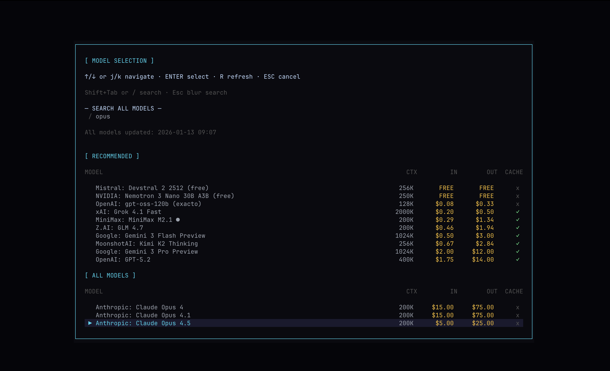

# DAEMON
**DAEMON** (pronounced "day-mon") is an opinionated **terminal-based AI agent** with distinct sci-fi theming,
delivered through a well-thought-out TUI powered by [OpenTUI](https://github.com/anomalyco/opentui).
It supports **text and voice interaction** and can be fully controlled through **hotkeys**.

DAEMON is focused on **information-gathering workflows** that benefit from **grounded responses**
but can also interact with and **control** your system through the terminal with scoped permissions.


## Highlights

### 👤 Interactive Avatar
At the core of the TUI is DAEMON's **animated avatar**, reacting to what it's doing in real time:
listening to audio input, reasoning about questions, calling tools, and generating an answer.

The avatar was deliberately designed to feel slightly ominous and alien-like playing into

### 🧠 LLMs
DAEMON can be powered by **any** model available on [OpenRouter](https://openrouter.ai/models).
The TUI includes a model picker that can fetch and select models as they become available on OpenRouter.
Models are sorted by average provider pricing and the picker includes information about their context window and caching support.
Once a model is selected, the **selection of the inference provider** is possible. Open-source models can vary strongly between providers.
> While all models on OpenRouter are supported, a curated list is included for the best experience.
It is generally recommended to use Models that support caching due to being significantly cheaper in DAEMON




### 🎙️ Voice capabilities
SOTA transcription accuracy is achieved by using OpenAI's latest transcription model `gpt-4o-mini-transcribe-2025-03-20`.
It features a large vocabulary and can transcribe multilingual inputs with complex terminology.

OpenAI's TTS model `gpt-4o-mini-tts-2025-03-20` is used to generate voice output with as little latency as possible.

### 🔎 Web Search
DAEMON uses the [Exa](https://exa.ai/) search and fetch API for retrieving accurate and up-to-date information.

### 💾 Session Persistence
DAEMON stores chat sessions locally (SQLite) and lets you resume past conversations.

## ✨ Feature List

| Feature | Description |
| --- | --- |
| Terminal TUI | OpenTUI-powered interface with sci-fi styling and hotkey controls. |
| Text + Voice | Supports text input and voice interaction with transcription and TTS. |
| Animated Avatar | Sci-fi avatar reacts to listening, tool use, and response generation. |
| Multi-Model Support | Works with all OpenRouter models and includes a curated default list. |
| Session Persistence | Preferences and chat sessions stored locally on disk. |
| Workspaces | On-disk workspaces for the agent to work in. |
| Web Search | Exa-based search and fetch for grounded, up-to-date info. |
| Grounding | Text-fragment grounding with a dedicated UI. |
| Bash Execution | Bash integration with approval scoping for potentially dangerous commands. |
| JS Page Rendering | Optional Playwright renderer for SPA content. |

## 📦 Install (npm/bun)

DAEMON is published as a CLI package. It **requires Bun** at runtime, even if you install via npm.

To install bun on macOs/Linux
```bash
curl -fsSL https://bun.com/install | bash
```
Then install DAEMON:
```bash
# Global npm install
npm i -g @makefinks/daemon
# or via bun
bun add -g @makefinks/daemon

# Then run
daemon
```

Configuration is done via environment variables (or the onboarding UI):

- `OPENROUTER_API_KEY` (required) - response generation via OpenRouter models
- `EXA_API_KEY` (optional) - enables web search + fetch grounding via Exa
- `OPENAI_API_KEY` (optional) - enables voice transcription + TTS

> Keys entered via the onboarding UI are stored locally in `~/.config/daemon/credentials.json` with restricted permissions (`0600`). For maximum security, use environment variables instead.

## 🛠️ System dependencies

Voice input requires `sox` and platform-specific audio libraries:

### macOS
```bash
brew install sox
```

### Linux (Debian/Ubuntu)
```bash
sudo apt install sox libsox-fmt-pulse
```

### Linux (Fedora)
```bash
sudo dnf install sox sox-plugins-freeworld
```

### Linux (Arch)
```bash
sudo pacman -S sox
```

## 🧩 Optional: JS-rendered page support (`renderUrl`)

DAEMON defaults to Exa-based `fetchUrls` for retrieving web page text. For JavaScript-heavy sites (SPAs) where `fetchUrls` returns "shell-only" content, DAEMON can optionally use a local Playwright Chromium renderer via the `renderUrl` tool.

This feature is **optional** and intentionally not installed by default (browser downloads are large). The render tool is not available to DAEMON without the installation below.

### For global installs (`npm i -g` / `bun add -g`)

Playwright must also be installed globally:

```bash
# 1) Install Playwright globally
npm i -g playwright
# or
bun add -g playwright

# 2) Install Chromium browser binaries
npx playwright install chromium
```
