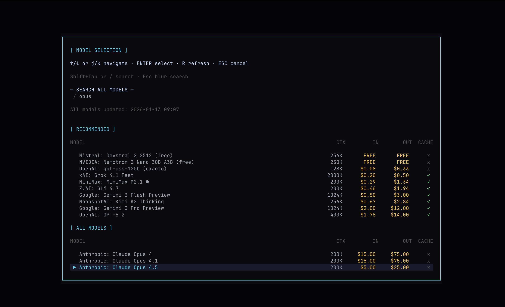
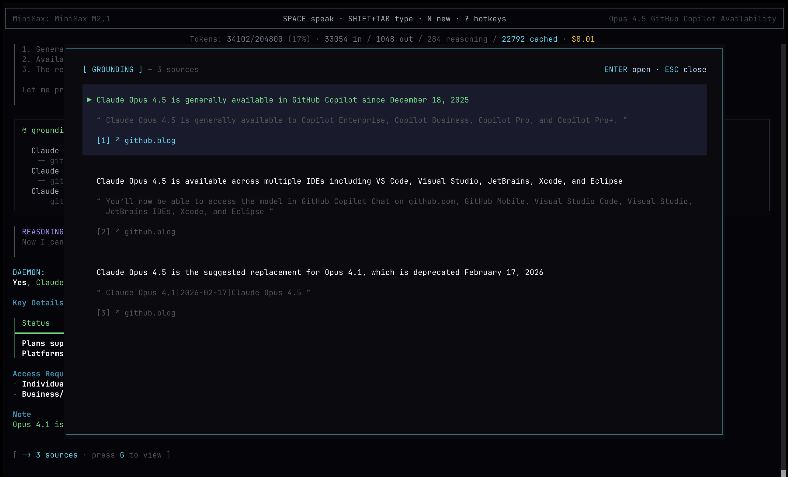
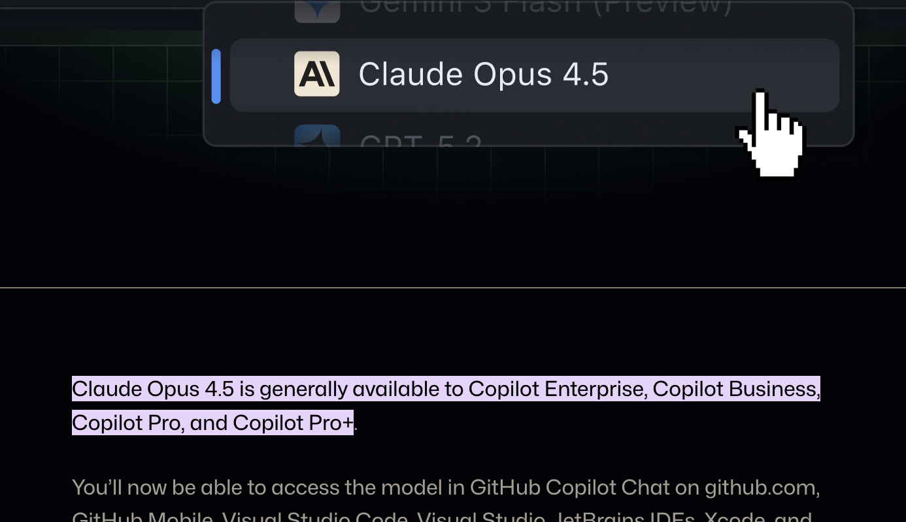
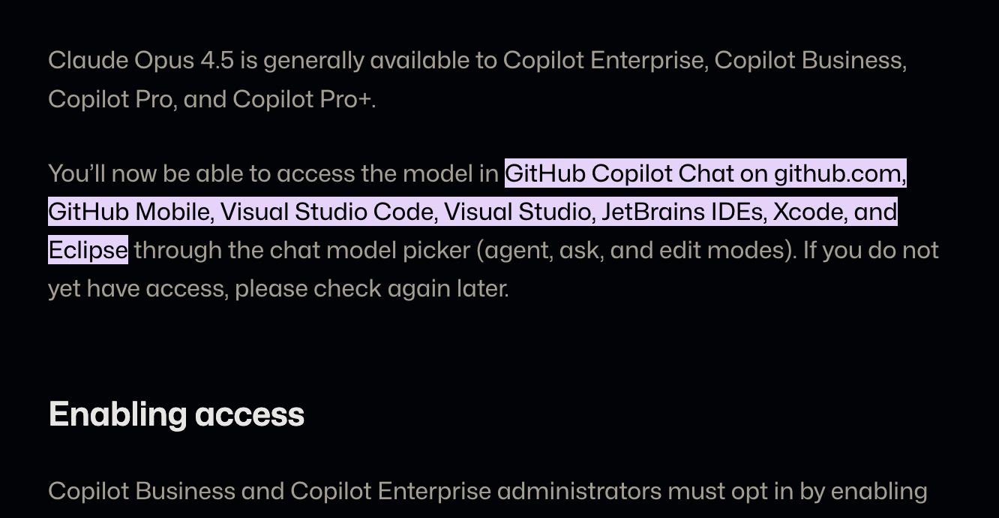

# DAEMON
**DAEMON** (pronounced "day-mon") is an opinionated **terminal-based AI agent** with distinct sci-fi theming,
delivered through a highly performant TUI powered by [OpenTUI](https://github.com/anomalyco/opentui).

It supports **text and voice interaction**, can be fully controlled through **hotkeys** and offers **vim-like controls**.

DAEMON is focused on **information-gathering workflows** that benefit from **grounded responses**
but can also interact with and **control** your system through the terminal with scoped permissions.


## Installation

```bash
npm i -g @makefinks/daemon --loglevel=error

# Additional installs (Audio)
brew install sox
```

Then run with:
```bash
daemon
```

#### ⚠️ Important Notes
> 1. **Development** requires [Bun](https://bun.sh) (`curl -fsSL https://bun.com/install | bash`).
> 2. Windows is currently **not** supported (Only by using WSL - with minor issues)

See full installation details below for configuration and system dependencies.

## Highlights

### 👤 Interactive Avatar
At the core of the TUI is DAEMON's **animated avatar**, reacting to what it's doing in real time:
listening to audio input, reasoning about questions, calling tools, and generating an answer.

The avatar was deliberately designed to feel slightly ominous and alien-like playing into sci-fi depictions.

### 🧠 LLMs
DAEMON supports two model backends:
- **OpenRouter** (API key based)
- **GitHub Copilot** (GitHub-authenticated via Copilot CLI / SDK) (Experimental!)

For OpenRouter, DAEMON can fetch and browse available models and route to a specific OpenRouter inference provider.
For GitHub Copilot, DAEMON can use your Copilot subscription and list available Copilot models when authenticated.




### 🎙️ Voice capabilities
SOTA transcription accuracy is achieved by using OpenAI's latest transcription model `gpt-4o-mini-transcribe-2025-03-20`.
It features a large vocabulary and can transcribe multilingual inputs with complex terminology.

OpenAI's TTS model `gpt-4o-mini-tts-2025-03-20` is used to generate voice output with as little latency as possible.

### 🔎 Web Search with Grounding
DAEMON uses the [Exa](https://exa.ai/) search and fetch API for retrieving **accurate** and **up-to-date information**.

After fetching relevant information, DAEMON has the ability to **ground** statements with **source links** that contain **highlightable fragments**.
The TUI comes with a menu for reading, verifying and opening sources for the current session.


For most statements, pressing Enter opens the source in your browser and **highlights the passage that supports the claim**.

<p align="center">
  
  
</p>
While DAEMON is encouraged to always cite sources you can always prompt to get groundings:

> "Use the grounding tool" / "Ground your answers"

### 💾 Session Persistence
DAEMON stores chat sessions locally (SQLite) and lets you resume past conversations.

### 🧠 Memory (mem0)
DAEMON can persist user-specific facts across sessions using [mem0](https://github.com/mem0ai/mem0). Memory extraction runs automatically on user messages and relevant memories are injected into the conversation when helpful. 

## ✨ Feature List

| Feature | Description |
| --- | --- |
| Terminal TUI | OpenTUI-powered interface with sci-fi styling and hotkey controls. |
| Text + Voice | Supports text input and voice interaction with transcription and TTS. |
| Animated Avatar | Sci-fi avatar reacts to listening, tool use, and response generation. |
| Multi-Model Support | Works with OpenRouter and GitHub Copilot model backends. |
| Session Persistence | Preferences and chat sessions stored locally on disk. |
| Memory  | Automatic persistance of user-specific facts with persistent recall using **mem0** |
| Workspaces | Session-scoped on-disk workspaces for the agent to work in. |
| Web Search | Exa-based search and fetch for grounded, up-to-date info. |
| Grounding | Text-fragment grounding with a dedicated UI. |
| Bash Execution | Bash integration with approval scoping for potentially dangerous commands. |
| Browser Tools | Built-in Chrome DevTools MCP for rendered pages, browser inspection, and frontend debugging. |
| MCP | Model Context Protocol tools. |

## 📦 Install (npm)

DAEMON is published as a CLI package.

```bash
# Global npm install
npm i -g @makefinks/daemon --loglevel=error

# Then run
daemon
```

Configuration is done via environment variables (or the onboarding UI):

- `OPENROUTER_API_KEY` (required only when OpenRouter is selected) - response generation via OpenRouter models
- `EXA_API_KEY` (optional) - enables web search + fetch grounding via Exa
- `OPENAI_API_KEY` (optional) - enables voice transcription + TTS

For Copilot, authenticate once with either GitHub CLI or Copilot CLI:

```bash
gh auth login
# or
copilot login
```

> ⚠️ GitHub Copilot authentication support is experimental.

> Keys entered via the onboarding UI are stored locally in `~/.config/daemon/credentials.json` with restricted permissions (`0600`). For maximum security, use environment variables instead.


## 🛠️ System dependencies

Voice input requires `sox` or other platform-specific audio libraries:

### macOS
```bash
brew install sox
```

### Linux (Debian/Ubuntu)
```bash
sudo apt install sox libsox-fmt-pulse
```

### Linux (Fedora)
```bash
sudo dnf install sox sox-plugins-freeworld
```

### Linux (Arch)
```bash
sudo pacman -S sox
```

## 🔌 MCP server setup (Model Context Protocol)

DAEMON can load MCP tools from external servers and expose them to the agent at runtime.
Chrome DevTools MCP ships as a built-in default server and can be toggled from the **Tools** menu.
Additional MCP servers are configured via a local config file.

Default config path:

- macOS/Linux: `~/.config/daemon/config.json`

Example config:

```json
{
  "mcpServers": [
    {
      "id": "local-mcp",
      "type": "http",
      "url": "http://localhost:3333/mcp"
    },
    {
      "type": "sse",
      "url": "https://example.com/mcp/sse"
    },
    {
      "id": "custom-stdio",
      "type": "stdio",
      "command": "npx",
      "args": ["-y", "some-mcp-server@latest"]
    }
  ]
}
```

Notes:

- The built-in Chrome DevTools server uses `npx -y chrome-devtools-mcp@latest` and launches Chrome with US English locale headers by default.
- `type` must be `http`, `sse`, or `stdio`.
- `url` is required for `http` and `sse` servers.
- `command` is required for `stdio` servers, and `args`, `cwd`, and `env` are optional.
- `id` is optional; if omitted, DAEMON derives one from the host.
- Defining a server with `id: "chrome-devtools"` overrides the built-in Chrome DevTools config.
- MCP server status, source, and enablement appear in the **Tools** menu.
